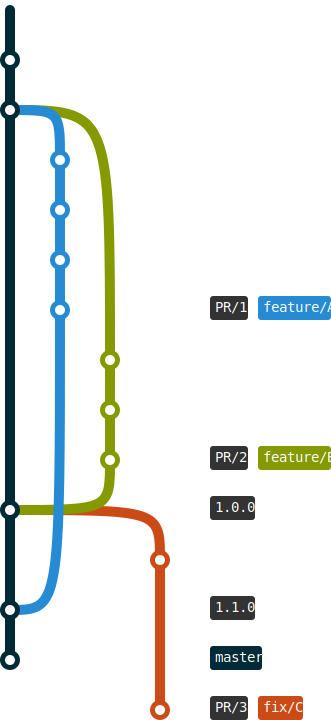

# Serverless Code Build

A bot automates pull requests delivery. It implements lightweight CI/CD pipelines, which are capable to deliver your microservices to cloud environments. This projects allows you to forget about housekeeping and administration of Jenkins or similar systems. The bot suites small engineering teams who owns entire life cycle of application.

## Inspiration



The bot is optimized to support either forking or branching workflow. Please see [Atlassian tutorial](https://www.atlassian.com/git/tutorials/comparing-workflows#forking-workflow) about them. As part of these workflows, it puts a strong focus to support engineering team with continuous **integration**, continuous **delivery** and continuous **deployment** of microservices. Continuous deployment is a key here. Please takes a look on few posts about this subject

[Practical continuous deployment: a guide to automated software delivery](https://www.atlassian.com/blog/continuous-delivery/practical-continuous-deployment) 

[Continuous Deployment at Instagram](https://instagram-engineering.com/continuous-deployment-at-instagram-1e18548f01d1)


### Why this bot exists?

We are building our solutions using small-decoupled deliverables - microservices. Our CI/CI still looks like monolith. Containers are the right approach to configure and deliver build environments, so called **build toolkit**. This bot provides an integration layer to [AWS CodeBuild](https://aws.amazon.com/codebuild/), which is a fully managed continuous integration service. These build toolkit are fully managed in your AWS account, which gives extra visibility on your processes. 

The Code Build Bot does similar things as [AWS Code Pipeline](https://aws.amazon.com/codepipeline/) with an exception everything happens inside single CodeBuild session. Code Pipeline do have **cost factor** unless you are using [Monorepo](https://en.wikipedia.org/wiki/Monorepo). My workflows are optimized to gain most of productivity using Multirepo. You can easily inflate Code Pipeline costs above $1200 per year. Secondly, the bot supports both private and open source projects, [you pay](https://aws.amazon.com/codebuild/pricing/) only for usage of AWS CodeBuild.

**Infrastructure as a Code** is only the right way to manage cloud resources. The provisioning and deployment of cloud resources shall be aligned with a service delivery and orchestrated by CI/CD system. This bot supports IaaC automation using either [Cloud Formation](https://aws.amazon.com/cloudformation/) or [AWS CDK](https://docs.aws.amazon.com/cdk/latest/guide/home.html). The **deployment automation** is a key feature here, please see my workflow for details. 

Often, **flexibility on configurations** becomes an issue if you are using custom CI/CD API or point-and-click UIs, especially if you are aiming 100% automation. Everything shall be code including CI/CD pipelines. The Code Build Bot promotes usage of AWS CDK or shell scripts to implement delivery pipelines. This is extremely important with modern processes that relies on heterogenous technologies (e.g. `npm` is optimized for building and packaging JavaScript application but this is a wrong tool to make cloud deployments - `cdk` shall be used). 

As developer I want to have a **repeatable pipelines** so that exactly same automation pipeline is executed by CI/CD and myself while testing/development. This overlooked if your team follows segregation of application development from operations (DevOps). This also means co-allocation of pipelines configuration next to application code. 

This bot helps to offload **privacy and secret management** to AWS services such as KMS, Secrets Manager or other. This feature allows you to host open-source applications with full automation on lifecycle management while retain confidentiality about your deployments. 

Afterwords, CI/CD is not a rocket science. The market is full of various solution. Almost all cloud providers has they own, almost any software version control system offers they own. You have to choose a solution that suites your workflow. The Code Build Bot has been developed just to resolve my customization requirements. I'd like to have a depth sense of machinery that makes an automation build with AWS serverless technology stack.


### Workflow

Entire workflow does not differ at all from forking or branching. It just emphasis continuous **deployment** as a key feature along the workflow. It supports integration testing and helps to eliminate all related issues at earlier phases of feature delivery process:

1. The `master` branch of your project is always `latest` deployable snapshot of a software asset. The bot automates the `master` snapshot deployments every time when new feature is merged.

2. The feature integration into `master` is implemented through pull request. The bot executes automated pull request deployment to sandbox environment every time a new changes is proposed by developers (each commit). The deployments happens after quality checks are successfully completed. The sandbox environment gives you possibility to execute integration tests.

3. The merge of pull request triggers the deployment of `master` branch into the `latest` environment. Use this environment for features validation before delivery to live  

4. The delivery of `latest` environment to live is automated using git tags. A provisioning a new tag caused an new immutable deployment of your application to live environment, which makes it compliant with green/blue deployment schemas.


## Getting started

The latest version of the bot is available at its `master` branch. All development, including new features and bug fixes, take place on the `master` branch using forking and pull requests as described in contribution guidelines.

The deployment requires TypeScript, AWS CDK and valid AWS credentials.

```bash
npm install -g aws-cdk typescript ts-node
```

You have to configure the bot behavior before the installation

```bash
##
## Create a personal access token at GitHub with repo level permissions
export GITHUB_TOKEN=deadbeefa1facecafe

##
## Allocate a api secret key to protect your api
## https://developer.github.com/webhooks/securing/
export API_KEY=secret

##
## The domain to deploy Code Bot api
## (e.g. https://ci.example.com) 
export CI_DOMAIN=example.com
```

Use Makefile orchestration to build and deploy the bot to your account.

```bash
make

## ...
## CodeBuildBot: deploying...
## CodeBuildBot: creating CloudFormation changeset...
## ...
## Outputs:
##  CodeBuildBot.RestApiGatewayEndpoint = https://xxx.execute-api.eu-west-1.amazonaws.com/api/
```

### Configure build environments

A build environment is a docker container at your AWS ECR that contains all necessary utilities to execute your build. Please see [AWS samples](https://docs.aws.amazon.com/codebuild/latest/userguide/sample-docker-custom-image.html). A code snippet below show a minimal build environment for serverless TypeScript applications.

```Dockerfile
FROM amazonlinux:2.0.20190508

RUN set -eu \
    && curl --silent --location https://rpm.nodesource.com/setup_10.x | bash - \
    && yum install -y nodejs \
    && npm install -g typescript ts-node aws-cdk
```

### Configure projects

Use Output endpoint as webhook for your repositories

* Payload URL `https://ci.example.com/api/webhook`
* Content type `application/json`
* Secret (value of API_KEY) `secret`
* Pick individual events
  - Branch or tag deletion
  - Branch or tag creation
  - Pull requests
  - Pushes

Add `.codebuild.json` to your project. The file supports auto-configuration of CodeBuild projects to your account

```javascript
{
   "image": "code-build/serverless",
   "approver": ["fogfish"]
}
```

* `image` - reference to build environment
* `approver` - users who's contribution is automatically deployed 


## Licensee

[](LICENSE)
